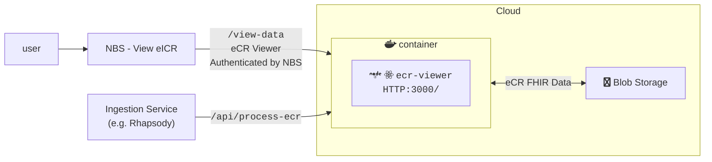
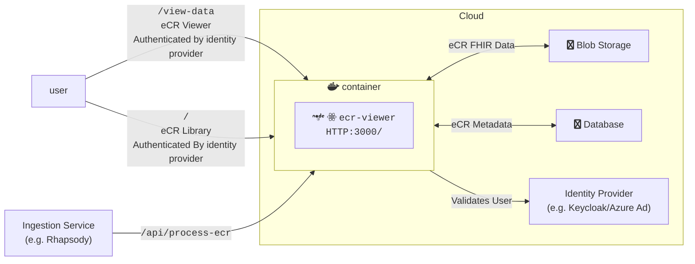
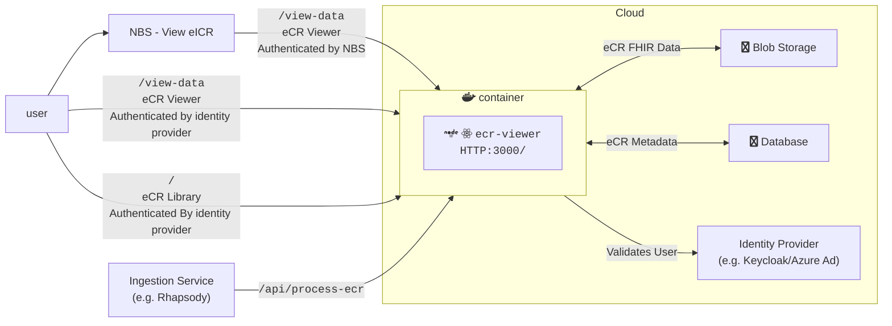

# eCR Viewer Setup Guide

## General Background

The eCR Viewer can be run in three modes.

| Mode             | Features Available | Metadata Support       | Authentication Supported                      | Environment Variables Needed                                                                                                                                                                                                        |
| ---------------- | ------------------ | ---------------------- | --------------------------------------------- | ----------------------------------------------------------------------------------------------------------------------------------------------------------------------------------------------------------------------------------- |
| `INTEGRATED`     | Viewer             | None                   | NBS                                           | [Base](#base-required), [eCR FHIR Storage](#ecr-fhir-storage), [Integrated Authentication](#integrated-authentication)                                                                                                              |
| `NON_INTEGRATED` | Viewer, Library    | SQL Server or Postgres | External authentication provider              | [Base](#base-required), [eCR FHIR Storage](#ecr-fhir-storage), [Non-Integrated Authentication](#non-integrated-authentication), [Metadata Database](#ecr-metadata-storage)                                                          |
| `DUAL`           | Viewer, Library    | SQL Server or Postgres | Both NBS and external authentication provider | [Base](#base-required), [eCR FHIR Storage](#ecr-fhir-storage), [Integrated Authentication](#integrated-authentication), [Non-Integrated Authentication](#non-integrated-authentication), [Metadata Database](#ecr-metadata-storage) |

### Integrated Architecture Diagram



### Non-Integrated Architecture Diagram



### Dual Architecture Diagram



## Environment Variable Setup

The full list of environment variables can be found in {@link NodeJS.ProcessEnv}. Below, you'll find more information about the groups of environment variables supported by the Viewer.

### Base Required

Base required variables are ones required for all deployments regardless of mode or cloud environment. If variables are not set, this may cause issues starting the app. The variables can be found in {@link EnvironmentVariables.BaseRequired}.

### eCR Fhir Storage

A storage container for the eCRs must be created for all deployments. Depending on the storage container used additional variables may be required. The variables can be found in {@link EnvironmentVariables.EcrStorage}.

### Authentication Setup

Authentication is required when running any mode of the application.

#### Integrated Authentication

Integrated eCR Viewer will rely on NBS to authenticate the user. The variables can be found in {@link EnvironmentVariables.Authentication}.

#### Non-Integrated Authentication

Non-Integrated/Dual rely on an external authentication provider, like Azure AD, Entra, or Keycloak. The variables can be found in {@link EnvironmentVariables.Authentication}.

#### Token Authentication for `api` routes

Most `/ecr-viewer/api/` routes require authentication to be used. The exceptions are pubic routes such as the health check and authentication routes. If a user has a logged in browser session (non-integrated auth only), they can use the developer console of that browser to emit authenticated post routes. More often, a machine will be making the post requests to upload data to the viewer. To enable this, we allow tokens to be sent on the `Authorization` header of request and used to authenticate the request.

For integrated auth, the token will be generated via a key pair, similar to how it is done for authentication to the `/view-data` page, but using a different private/public key pair. See {@link EnvironmentVariables.Authentication} for where to set the public key.

For non-integrated auth, the token must be generated by the IDP service, typically using a service principal. The token will be validated using the authentication provider set up in {@link EnvironmentVariables.Authentication}.

### eCR Metadata Storage

Non-Integrated/Dual require a database to store eCR metadata. The variables can be found in {@link EnvironmentVariables.EcrMetadataStorage}.

### Removed Environment Variables

These are variables that have been retired and no longer have a use in the app. These can be safely removed when installing the current version.

| Name                  | Description                  | Version Removed |
| --------------------- | ---------------------------- | --------------- |
| `SQL_SERVER_HOST`     | Replaced with `DATABASE_URL` | 3.1             |
| `SQL_SERVER_PASSWORD` | Replaced with `DATABASE_URL` | 3.1             |
| `SQL_SERVER_USER`     | Replaced with `DATABASE_URL` | 3.1             |

## Inserting data

### From Rhapsody

Data can be added to the eCR Viewer as a step in Rhapsody.

Rhapsody documentation and an example route can be found [here](https://github.com/CDCgov/dibbs-ecr-viewer/tree/main/examples/rhapsody).

### From API

Data can be added directly via API requeset to eCR Viewer's `/process-ecr` endpoint. See the [API documentation](./api-documentation.md) for more details.

```bash
# zip file
curl --location '{URL}/ecr-viewer/api/process-ecr' \
--form 'ecr=@"/path/to/eicr.zip";type=application/zip'
```

```sh
# string contents
curl --location '<DIBBS_URL>/ecr-viewer/api/process-ecr' \
--form 'ecr=<"<PATH_TO_ECR_FILE>"' \
--form 'rr=<"<PATH_TO_RR_FILE>"'
```

## Database Setup

A database user must be created and the credentials set in the corresponding environment variables described here {@link EnvironmentVariables.EcrMetadataStorage}. This user must have standard privileges (select, update, delete) as well as the ability to create and alter schemas and tables. All database setup after that point is handled via migrations performed by [Kysely](https://kysely.dev/docs/migrations). If the latest migration has not been run the eCR Viewer will log an error and display an error page to the user. Migrations only need to be run once to bring the database up to date, even if there have been multiple updates added since your most recently installed version. They must be triggered manually by calling the `/migrate-db` endpoint. The migration secret required for this step may be set via the `METADATA_DATABASE_MIGRATION_SECRET` environment variable, but if it is not set then the eCR Viewer will generate a secret and output it to the server logs both at startup and when a request is made to the API without a valid secret included.

```bash
curl --location '<DIBBS_URL>/ecr-viewer/api/migrate-db' \
--form 'migration_secret=<your migration secret>'
```
