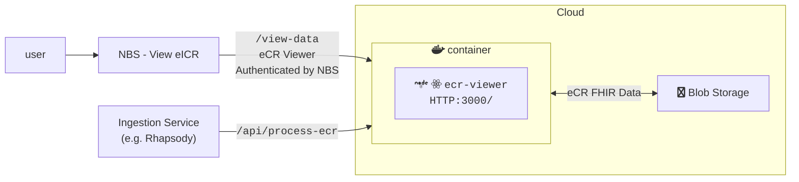
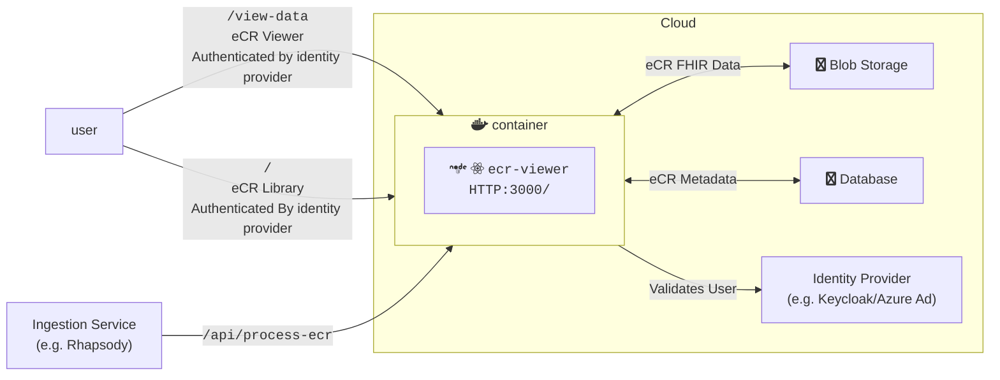
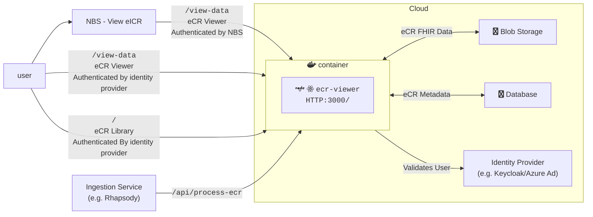

# eCR Viewer Setup Guide

## General Background

The eCR Viewer can be run in three modes.

| Mode             | Features Available | Metadata Support       | Authentication Supported                      | Environment Variables Needed                                                                                                                                                                                                        |
| ---------------- | ------------------ | ---------------------- | --------------------------------------------- | ----------------------------------------------------------------------------------------------------------------------------------------------------------------------------------------------------------------------------------- |
| `INTEGRATED`     | Viewer             | None                   | NBS                                           | [Base](#base-required), [eCR FHIR Storage](#ecr-fhir-storage), [Integrated Authentication](#integrated-authentication)                                                                                                              |
| `NON_INTEGRATED` | Viewer, Library    | SQL Server or Postgres | External authentication provider              | [Base](#base-required), [eCR FHIR Storage](#ecr-fhir-storage), [Non-Integrated Authentication](#non-integrated-authentication), [Metadata Database](#ecr-metadata-storage)                                                          |
| `DUAL`           | Viewer, Library    | SQL Server or Postgres | Both NBS and external authentication provider | [Base](#base-required), [eCR FHIR Storage](#ecr-fhir-storage), [Integrated Authentication](#integrated-authentication), [Non-Integrated Authentication](#non-integrated-authentication), [Metadata Database](#ecr-metadata-storage) |

### Integrated Architecture Diagram



### Non-Integrated Architecture Diagram



### Dual Architecture Diagram



## Environment Variable Setup

The full list of environment variables can be found in {@link NodeJS.ProcessEnv}. Below, you'll find more information about the groups of environment variables supported by the Viewer.

### Base Required

Base required variables are ones required for all deployments regardless of mode or cloud environment. If variables are not set, this may cause issues starting the app. The variables can be found in {@link EnvironmentVariables.BaseRequired}.

### eCR Fhir Storage

A storage container for the eCRs must be created for all deployments. Depending on the storage container used additional variables may be required. The variables can be found in {@link EnvironmentVariables.EcrStorage}.

### Authentication Setup

Authentication is required when running any mode of the application.

#### Integrated Authentication

Integrated eCR Viewer will rely on NBS to authenticate the user. The variables can be found in {@link EnvironmentVariables.Authentication}.

#### Non-Integrated Authentication

Non-Integrated/Dual rely on an external authentication provider, like Azure AD, Entra, or Keycloak. The variables can be found in {@link EnvironmentVariables.Authentication}.

#### Token Authentication for `api` routes

Most `/ecr-viewer/api/` routes require authentication to be used. The exceptions are pubic routes such as the health check and authentication routes. If a user has a logged in browser session (non-integrated auth only), they can use the developer console of that browser to emit authenticated post routes. More often, a machine will be making the post requests to upload data to the viewer. To enable this, we allow tokens to be sent on the `Authorization` header of request and used to authenticate the request.

For integrated auth, the token will be generated via a key pair, similar to how it is done for authentication to the `/view-data` page, but using a different private/public key pair. See {@link EnvironmentVariables.Authentication} for where to set the public key.

For non-integrated auth, the token must be generated by the IDP service, typically using a service principal. The token will be validated using the authentication provider set up in {@link EnvironmentVariables.Authentication}.

### eCR Metadata Storage

Non-Integrated/Dual require a database to store eCR metadata. The variables can be found in {@link EnvironmentVariables.EcrMetadataStorage}.

### Removed Environment Variables

These are variables that have been retired and no longer have a use in the app. These can be safely removed when installing the current version.

| Name                  | Description                  | Version Removed |
| --------------------- | ---------------------------- | --------------- |
| `SQL_SERVER_HOST`     | Replaced with `DATABASE_URL` | 3.1             |
| `SQL_SERVER_PASSWORD` | Replaced with `DATABASE_URL` | 3.1             |
| `SQL_SERVER_USER`     | Replaced with `DATABASE_URL` | 3.1             |

## Database Setup

A database user must be created and the credentials set in the corresponding environment variables described here {@link EnvironmentVariables.EcrMetadataStorage}. This user must have standard privileges (select, update, delete) as well as the ability to create and alter schemas and tables. All database setup after that point is handled via migrations performed by [Kysely](https://kysely.dev/docs/migrations). If the latest migration has not been run the eCR Viewer will log an error and display an error page to the user. Migrations only need to be run once to bring the database up to date, even if there have been multiple updates added since your most recently installed version. They must be triggered manually by calling the `/migrate-db` endpoint. The migration secret required for this step may be set via the `METADATA_DATABASE_MIGRATION_SECRET` environment variable, but if it is not set then the eCR Viewer will generate a secret and output it to the server logs both at startup and when a request is made to the API without a valid secret included.

Additionally, the optional field `init_admin_email` should be included when initializing the database in order to add an admin user for the first time. Please see the "User and Program Area Setup" section for more details.

```bash
curl --location '<DIBBS_URL>/ecr-viewer/api/migrate-db' \
--header 'Authorization: Bearer <TOKEN>'
--form 'migration_secret=<your migration secret>' \
--form 'init_admin_email=<email>'
```

## Database Documentation

This section provides an overview of the database schema used by the DIBBS eCR Viewer, including both the core and extended schemas, and information about supported database types.

### Supported Database Types

The DIBBS eCR Viewer supports the following relational database types for storing metadata:

*   **SQL Server**
*   **PostgreSQL**

### Core Schema

The core schema contains essential data related to eCRs and their associated conditions and rule summaries. This schema is fundamental to the operation of the eCR Viewer.

#### `ecr_data` Table

This table stores the primary eCR data.

| Column Name           | Data Type      | Description                                                               |
| :-------------------- | :------------- | :------------------------------------------------------------------------ |
| `eicr_id`             | `varchar(200)` | Primary key, unique identifier for the eICR.                              |
| `set_id`              | `varchar(255)` | Identifier for a set of related eICRs.                                    |
| `eicr_version_number` | `varchar(50)`  | Version number of the eICR.                                               |
| `fhir_reference_link` | `varchar(255)` | Reference link to the FHIR resource.                                      |
| `last_name`           | `varchar(255)` | Last name of the patient (non-nullable).                                  |
| `first_name`          | `varchar(255)` | First name of the patient (non-nullable).                                 |
| `birth_date`          | `date`         | Patient's birth date (non-nullable).                                      |
| `encounter_start_date`| `datetime`     | Start date and time of the patient encounter.                             |
| `date_created`        | `datetime`     | Date and time when the record was created (non-nullable, defaults to now).|

#### `ecr_rr_conditions` Table

This table stores conditions associated with eCRs.

| Column Name           | Data Type      | Description                               |
| :-------------------- | :------------- | :---------------------------------------- |
| `uuid`                | `varchar(200)` | Primary key, unique identifier for the condition record. |
| `eicr_id`             | `varchar(255)` | Foreign key, references `eicr_data.eicr_id`. |
| `condition`           | `varchar(max)` | Description of the condition.             |

#### `ecr_rr_rule_summaries` Table

This table stores rule summaries related to eCR conditions.

| Column Name           | Data Type      | Description                               |
| :-------------------- | :------------- | :---------------------------------------- |
| `uuid`                | `varchar(200)` | Primary key, unique identifier for the rule summary record. |
| `ecr_rr_conditions_id`| `varchar(200)` | Foreign key, references `ecr_rr_conditions.uuid`. |
| `rule_summary`        | `varchar(max)` | Summary of the rule applied.              |

### Extended Schema

The extended schema builds upon the core schema by adding additional demographic, clinical, and administrative data points to the `ecr_data` table, and introduces new tables for laboratory results and patient addresses. This schema provides a more comprehensive view of the eCR data.

#### Alterations to `ecr_data` Table

The following columns are added to the `ecr_data` table in the extended schema:

| Column Name                  | Data Type      | Description                                    |
| :--------------------------- | :------------- | :--------------------------------------------- |
| `gender`                     | `varchar(100)` | Patient's gender.                              |
| `birth_sex`                  | `varchar(255)` | Patient's birth sex.                           |
| `gender_identity`            | `varchar(255)` | Patient's gender identity.                     |
| `race`                       | `varchar(255)` | Patient's race.                                |
| `ethnicity`                  | `varchar(255)` | Patient's ethnicity.                           |
| `latitude`                   | `numeric`      | Latitude of patient's location.                |
| `longitude`                  | `numeric`      | Longitude of patient's location.               |
| `homelessness_status`        | `varchar(255)` | Patient's homelessness status.                 |
| `disabilities`               | `varchar(255)` | Patient's disabilities.                        |
| `tribal_affiliation`         | `varchar(255)` | Patient's tribal affiliation.                  |
| `tribal_enrollment_status`   | `varchar(255)` | Patient's tribal enrollment status.            |
| `current_job_title`          | `varchar(255)` | Patient's current job title.                   |
| `current_job_industry`       | `varchar(255)` | Patient's current job industry.                |
| `usual_occupation`           | `varchar(255)` | Patient's usual occupation.                    |
| `usual_industry`             | `varchar(255)` | Patient's usual industry.                      |
| `preferred_language`         | `varchar(255)` | Patient's preferred language.                  |
| `pregnancy_status`           | `varchar(255)` | Patient's pregnancy status.                    |
| `rr_id`                      | `varchar(255)` | Response Report ID.                            |
| `processing_status`          | `varchar(255)` | Processing status of the eCR.                  |
| `authoring_date`             | `datetime`     | Date of authoring.                             |
| `authoring_provider`         | `varchar(255)` | Authoring provider.                            |
| `provider_id`                | `varchar(255)` | Provider ID.                                   |
| `facility_id`                | `varchar(255)` | Facility ID.                                   |
| `facility_name`              | `varchar(255)` | Facility name.                                 |
| `encounter_type`             | `varchar(255)` | Type of encounter.                             |
| `encounter_end_date`         | `datetime`     | End date and time of the patient encounter.    |
| `reason_for_visit`           | `varchar(max)` | Reason for visit.                              |
| `active_problems`            | `varchar(max)` | Active problems.                               |

#### `ecr_labs` Table

This table stores laboratory results associated with eCRs.

| Column Name                         | Data Type      | Description                                    |
| :---------------------------------- | :------------- | :--------------------------------------------- |
| `uuid`                              | `varchar(200)` | Primary key, unique identifier for the lab record. |
| `eicr_id`                           | `varchar(200)` | Foreign key, references `ecr_data.eicr_id`.    |
| `test_type`                         | `varchar(255)` | Type of test performed.                        |
| `test_type_code`                    | `varchar(255)` | Code for the test type.                        |
| `test_type_system`                  | `varchar(255)` | Coding system for the test type.               |
| `test_result_qualitative`           | `varchar(255)` | Qualitative test result.                       |
| `test_result_quantitative`          | `numeric`      | Quantitative test result.                      |
| `test_result_units`                 | `varchar(50)`  | Units for the quantitative test result.        |
| `test_result_code`                  | `varchar(255)` | Code for the test result.                      |
| `test_result_code_display`          | `varchar(255)` | Display name for the test result code.         |
| `test_result_code_system`           | `varchar(255)` | Coding system for the test result code.        |
| `test_result_interpretation`        | `varchar(255)` | Interpretation of the test result.             |
| `test_result_interpretation_code`   | `varchar(255)` | Code for the test result interpretation.       |
| `test_result_interpretation_system` | `varchar(255)` | Coding system for the test result interpretation. |
| `test_result_reference_range_low_value` | `numeric`    | Lower bound of the reference range.            |
| `test_result_reference_range_low_units` | `varchar(50)`| Units for the lower bound of the reference range. |
| `test_result_reference_range_high_value`| `numeric`    | Upper bound of the reference range.            |
| `test_result_reference_range_high_units`| `varchar(50)`| Units for the upper bound of the reference range. |
| `specimen_type`                     | `varchar(255)` | Type of specimen.                              |
| `specimen_collection_date`          | `date`         | Date of specimen collection.                   |
| `performing_lab`                    | `varchar(255)` | Performing laboratory.                         |

#### `patient_address` Table

This table stores patient address information.

| Column Name   | Data Type      | Description                               |
| :------------ | :------------- | :---------------------------------------- |
| `uuid`        | `varchar(200)` | Primary key, unique identifier for the address record. |
| `use`         | `varchar(50)`  | Purpose of the address (e.g., "home", "work"). |
| `type`        | `varchar(50)`  | Type of address (e.g., "physical", "postal"). |
| `text`        | `varchar(255)` | Full text representation of the address.  |
| `line`        | `varchar(255)` | Street address line.                      |
| `city`        | `varchar(100)` | City.                                     |
| `district`    | `varchar(100)` | District.                                 |
| `state`       | `varchar(100)` | State.                                    |
| `postal_code` | `varchar(20)`  | Postal code.                              |
| `country`     | `varchar(100)` | Country.                                  |
| `period_start`| `datetime`     | Start date of the address's validity period. |
| `period_end`  | `datetime`     | End date of the address's validity period. |
| `eicr_id`     | `varchar(200)` | Foreign key, references `ecr_data.eicr_id`. |

## Inserting data

### From Rhapsody

Data can be added to the eCR Viewer as a step in Rhapsody.

See our [Rhapsody examples](https://github.com/CDCgov/dibbs-ecr-viewer/tree/main/examples/rhapsody) for more information on using Rhapsody to load data with different configurations of the eCR viewer.

### From API

Data can be added directly via API requeset to eCR Viewer's `/process-ecr` endpoint. See the [API documentation](./api-documentation.md) for more details.

```bash
# zip file
curl --location '{URL}/ecr-viewer/api/process-ecr' \
--form 'ecr=@"/path/to/eicr.zip";type=application/zip'
```

```sh
# string contents
curl --location '<DIBBS_URL>/ecr-viewer/api/process-ecr' \
--form 'ecr=<"<PATH_TO_ECR_FILE>"' \
--form 'rr=<"<PATH_TO_RR_FILE>"'
```

## User and Program Area Setup

### Initialization

Before using the app, you must initialize the database with an admin account. When making a `POST` request to the `/migrate-db` endpoint (see above), include the `init_admin_email` field in the form to designate which user (by email) should be granted admin access. This email must correspond to a real user in your IDP (e.g., Keycloak).

Once initialized, your IDP handles authentication. The user with the email provided in `init_admin_email` will have admin privileges and can log in to the app set up further users.

### Roles and Privileges

**Admins**: Have full access to manage program areas, user accounts, and to view all eCRs in the eCR Library.

1. **Program Area Management**

- Can create, edit, and delete program areas.
- Each program area must have at least one condition, and each program area name must be unique.
- A condition cannot belong to more than one program area.

2. **User Management**

- Can create, edit, and delete users.
- Users must have unique emails and standard users should be added to program areas to be able to view any eCRs.
- Deleting users will only remove them from the User management table and remove them from all assigned program areas, but will not delete them from the database and instead mark them as `"deleted"`.

3. **Access**

- Can access both the User Management and Program Management pages.
- Can access all eCRs in the eCR Library.

**Standard users**: Have limited access to eCRs based on their assigned program areas.

- Can view eCRs whose reportable conditions are included in their list of assigned program areas
