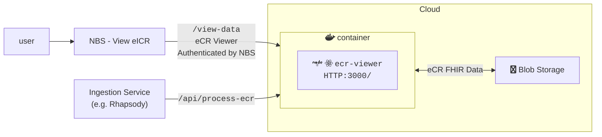
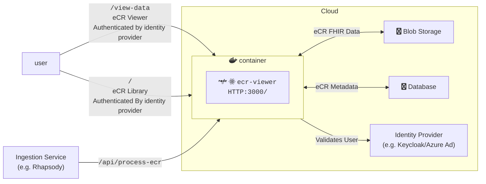
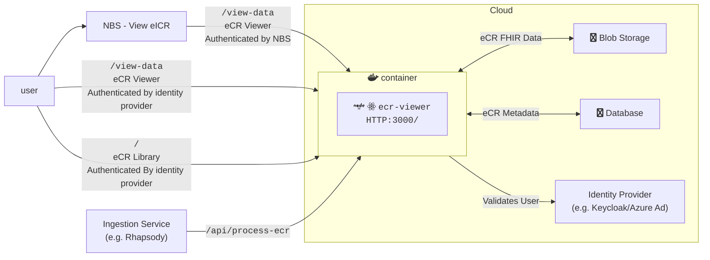

# eCR Viewer Setup Guide

## General Background

The eCR Viewer can be run in three modes.

| Mode             | Features Available | Metadata Support       | Authentication Supported                      | Environment Variables Needed                                                                                                                                                                                                        |
| ---------------- | ------------------ | ---------------------- | --------------------------------------------- | ----------------------------------------------------------------------------------------------------------------------------------------------------------------------------------------------------------------------------------- |
| `INTEGRATED`     | Viewer             | None                   | NBS                                           | [Base](#base-required), [eCR FHIR Storage](#ecr-fhir-storage), [Integrated Authentication](#integrated-authentication)                                                                                                              |
| `NON_INTEGRATED` | Viewer, Library    | SQL Server or Postgres | External authentication provider              | [Base](#base-required), [eCR FHIR Storage](#ecr-fhir-storage), [Non-Integrated Authentication](#non-integrated-authentication), [Metadata Database](#ecr-metadata-storage)                                                          |
| `DUAL`           | Viewer, Library    | SQL Server or Postgres | Both NBS and external authentication provider | [Base](#base-required), [eCR FHIR Storage](#ecr-fhir-storage), [Integrated Authentication](#integrated-authentication), [Non-Integrated Authentication](#non-integrated-authentication), [Metadata Database](#ecr-metadata-storage) |

### Integrated Architecture Diagram



### Non-Integrated Architecture Diagram



### Dual Architecture Diagram



## Environment Variable Setup

The full list of environment variables can be found in {@link NodeJS.ProcessEnv}. Below, you'll find more information about the groups of environment variables supported by the Viewer.

### Base Required

Base required variables are ones required for all deployments regardless of mode or cloud environment. If variables are not set, this may cause issues starting the app. The variables can be found in {@link EnvironmentVariables.BaseRequired}.

### eCR FHIR Storage

A storage container for the eCRs must be created for all deployments. Depending on the storage container used additional variables may be required. The variables can be found in {@link EnvironmentVariables.EcrStorage}.

### Authentication Setup

Authentication is required when running any mode of the application.

#### Integrated Authentication

Integrated eCR Viewer will rely on NBS to authenticate the user. The variables can be found in {@link EnvironmentVariables.Authentication}.

#### Non-Integrated Authentication

Non-Integrated/Dual rely on an external authentication provider, like Azure AD, Entra, or Keycloak. The variables can be found in {@link EnvironmentVariables.Authentication}.

#### Token Authentication for `api` routes

Most `/ecr-viewer/api/` routes require authentication to be used. The exceptions are public routes such as the health check and authentication routes. If a user has a logged in browser session (non-integrated auth only), they can use the developer console of that browser to emit authenticated post routes. More often, a machine will be making the post requests to upload data to the viewer. To enable this, we allow tokens to be sent on the `Authorization` header of request and used to authenticate the request.

For integrated auth, the token will be generated via a key pair, similar to how it is done for authentication to the `/view-data` page, but using a different private/public key pair. See {@link EnvironmentVariables.Authentication} for where to set the public key.

For non-integrated auth, the token must be generated by the IDP service, typically using a service principal. The token will be validated using the authentication provider set up in {@link EnvironmentVariables.Authentication}.

### eCR Metadata Storage

Non-Integrated/Dual require a database to store eCR metadata. The variables can be found in {@link EnvironmentVariables.EcrMetadataStorage}.

### Removed Environment Variables

These are variables that have been retired and no longer have a use in the app. These can be safely removed when installing the current version.

| Name                  | Description                  | Version Removed |
| --------------------- | ---------------------------- | --------------- |
| `SQL_SERVER_HOST`     | Replaced with `DATABASE_URL` | 3.1             |
| `SQL_SERVER_PASSWORD` | Replaced with `DATABASE_URL` | 3.1             |
| `SQL_SERVER_USER`     | Replaced with `DATABASE_URL` | 3.1             |

## Database Setup

A schema named `ecr_viewer` must first be created. A database user must be created and the credentials set in the corresponding environment variables described here {@link EnvironmentVariables.EcrMetadataStorage}. This user must have standard privileges in the `ecr_viewer` schema (select, update, delete) as well as the ability to create and alter tables. All database setup after that point is handled via migrations performed by [Kysely](https://kysely.dev/docs/migrations).

### Database Migrations

> [!IMPORTANT]
> If you are upgrading from DIBBs version 8.0.0 or earlier to version 9.0.0 or later, please follow [these instructions](https://github.com/CDCgov/dibbs-ecr-viewer/blob/main/containers/ecr-viewer/schema-migration-scripts/README.md) before running migrations.

If the latest migration has not been run the eCR Viewer will log an error and display an error page to the user. Migrations only need to be run once to bring the database up to date, even if there have been multiple updates added since your most recently installed version. They must be triggered manually by calling the `/migrate-db` endpoint. The migration secret required for this step may be set via the `METADATA_DATABASE_MIGRATION_SECRET` environment variable, but if it is not set then the eCR Viewer will generate a secret and output it to the server logs both at startup and when a request is made to the API without a valid secret included.

Additionally, the optional field `init_admin_email` should be included when initializing the database in order to add an admin user for the first time. Please see the "User and Program Area Setup" section for more details.

```bash
curl --location '<DIBBS_URL>/ecr-viewer/api/migrate-db' \
--header 'Authorization: Bearer <TOKEN>'
--form 'migration_secret=<your migration secret>' \
--form 'init_admin_email=<email>'
```

## Inserting data

### From Rhapsody

Data can be added to the eCR Viewer as a step in Rhapsody.

See our [Rhapsody examples](https://github.com/CDCgov/dibbs-ecr-viewer/tree/main/examples/rhapsody) for more information on using Rhapsody to load data with different configurations of the eCR viewer.

### From API

Data can be added directly via API request to eCR Viewer's `/process-ecr` endpoint. See the [API documentation](./api-documentation.md) for more details.

```bash
# zip file
curl --location '{URL}/ecr-viewer/api/process-ecr' \
--form 'ecr=@"/path/to/eicr.zip";type=application/zip'
```

```sh
# string contents
curl --location '<DIBBS_URL>/ecr-viewer/api/process-ecr' \
--form 'ecr=<"<PATH_TO_ECR_FILE>"' \
--form 'rr=<"<PATH_TO_RR_FILE>"'
```

When using the curl command to send zip files to ecr-viewer, the user has to use the flag type=application/zip. If not, they will receive this response message {"message":"Failed to process orchestration response"} and will see the error in the screenshot in their ecr-viewer logs.

## Deleting data

When a file is removed from blob storage (e.g., S3), it is no longer accessible within the eCR Viewer. However, the record will continue to appear in the library view, and any attempt to open the document will return a 404. To fully remove the record, it must also be deleted from the database.

SQL scripts for removing eCR records from the metadata database are provided in `seed-scripts/sql/`. Each script targets one database type and handles foreign key constraints automatically.

| Script                                               | Database   | Behavior                                                         |
| ---------------------------------------------------- | ---------- | ---------------------------------------------------------------- |
| `seed-scripts/sql/postgres/delete-ecr-by-id.sql`     | Postgres   | Deletes one eCR (and all child records) by `ecr_data.eicr_id`    |
| `seed-scripts/sql/sqlserver/delete-ecr-by-id.sql`    | SQL Server | Deletes one eCR (and all child records) by `ecr_data.eicr_id`    |
| `seed-scripts/sql/postgres/delete-ecrs-by-date.sql`  | Postgres   | Deletes eCRs (and all child records) created before a given date |
| `seed-scripts/sql/sqlserver/delete-ecrs-by-date.sql` | SQL Server | Deletes eCRs (and all child records) created before a given date |
| `seed-scripts/sql/postgres/delete-all-data.sql`      | Postgres   | Deletes **all** data from every table in the `ecr_viewer` schema |
| `seed-scripts/sql/sqlserver/delete-all-data.sql`     | SQL Server | Deletes **all** data from every table in the `ecr_viewer` schema |

### Delete by eCR ID

Open the appropriate script for your database and set the ID variable near the top of the file to the target `ecr_data.eicr_id`. Then run:

```bash
# Postgres
psql "$DATABASE_URL" -f seed-scripts/sql/postgres/delete-ecr-by-id.sql
# or
psql -U postgres -h <host> -d ecr_viewer_db -f seed-scripts/sql/postgres/delete-ecr-by-id.sql

# SQL Server
sqlcmd -S <server> -U <user> -P <password> -i seed-scripts/sql/sqlserver/delete-ecr-by-id.sql
```

Both scripts are safe to run against core and extended schema deployments - extended schema tables (`ecr_labs`, `ecr_immunizations`, `patient_address`) are deleted only when present.

### Delete by date

Open the appropriate script for your database and set the `cutoff_date` variable near the top of the file to the earliest date you want to **keep** (records created before that date will be deleted). Then run:

```bash
# Postgres
psql "$DATABASE_URL" -f seed-scripts/sql/postgres/delete-ecrs-by-date.sql
# or
psql -U postgres -h <host> -d ecr_viewer_db -f seed-scripts/sql/postgres/delete-ecrs-by-date.sql

# SQL Server
sqlcmd -S <server> -U <user> -P <password> -i seed-scripts/sql/sqlserver/delete-ecrs-by-date.sql
```

Both scripts are safe to run against core and extended schema deployments — extended schema tables (`ecr_labs`, `ecr_immunizations`, `patient_address`) are deleted only when present.

### Delete all data

> [!WARNING]
> The delete-all scripts remove every row from every table in the `ecr_viewer` schema, including user accounts and program areas. This cannot be undone. Take a database backup before running.

```bash
# Postgres
psql "$DATABASE_URL" -f seed-scripts/sql/postgres/delete-all-data.sql
# or
psql -U postgres -h <host> -d ecr_viewer_db -f seed-scripts/sql/postgres/delete-all-data.sql

# SQL Server
sqlcmd -S <server> -U <user> -P <password> -i seed-scripts/sql/sqlserver/delete-all-data.sql
```

After running a delete-all script, re-initialize the database by calling the `/migrate-db` endpoint with `init_admin_email` before the app can be used again (see [Database Migrations](#database-migrations)).

## User and Program Area Setup

### Initialization

Before using the app, you must initialize the database with an admin account. When making a `POST` request to the `/migrate-db` endpoint (see above), include the `init_admin_email` field in the form to designate which user (by email) should be granted admin access. This email must correspond to a real user in your IDP (e.g., Keycloak).

Once initialized, your IDP handles authentication. The user with the email provided in `init_admin_email` will have admin privileges and can log in to the app set up further users.

### Roles and Privileges

**Admins**: Have full access to manage program areas, user accounts, and to view all eCRs in the eCR Library.

1. **Program Area Management**
   - Can create, edit, and delete program areas.
   - Each program area must have at least one condition, and each program area name must be unique.
   - A condition cannot belong to more than one program area.

2. **User Management**
   - Can create, edit, and delete users.
   - Users must have unique emails and standard users should be added to program areas to be able to view any eCRs.
   - Deleting users will only remove them from the User management table and remove them from all assigned program areas, but will not delete them from the database and instead mark them as `"deleted"`.

3. **Access**
   - Can access both the User Management and Program Management pages.
   - Can access all eCRs in the eCR Library.

**Standard users**: Have limited access to eCRs based on their assigned program areas.

- Can view eCRs whose reportable conditions are included in their list of assigned program areas

## [Optional] FHIR Converter Proxy Setup

To setup or customize the FHIR Converter Proxy please follow the [setup instructions here](https://github.com/CDCgov/dibbs-ecr-viewer/blob/main/containers/fhir-converter-proxy/README.md).

## eCR Size Limits

The following table contains the maximum size at which the eCR Viewer can handle an eCR at a time. This information can be used to plan your infrastructure setup depending on the eCR load you are expecting. Any eCRs larger than these sizes will most likely result in errors during processing.

Default AWS Container size:

- CPU: 512
- Memory: 1024

Default Azure Container Size:

- CPU: 0.5
- Memory: 1Gi

| Cloud Provider | Mode         | Maximum eCR Size | FHIR Converter Container Size        |
| -------------- | ------------ | ---------------- | ------------------------------------ |
| AWS            | `DUAL`       | 41 MB            | CPU: 2048, Memory: 4096              |
| AWS            | `INTEGRATED` | 41 MB            | CPU: 2048, Memory: 4096              |
| Azure          | `DUAL`       | 16 MB            | CPU: 0.5, Memory: 1Gi (Default size) |
| Azure          | `DUAL`       | 42 MB            | CPU: 2, Memory: 4.0Gi                |
| Azure          | `INTEGRATED` | 42 MB            | CPU: 2, Memory: 4.0Gi                |

**Note on Azure**: The current Azure infrastructure has a hard request timeout of 240 seconds when processing eCRs, which happens at the Azure Container Apps ingress layer as documented [here](https://learn.microsoft.com/en-us/azure/container-apps/ingress-overview#http). This timeout could happen during an instance cold-start with the sizes listed above. Please retry the request if the timeout occurs (it will manifest as a 504 error with a `stream timeout` message).
