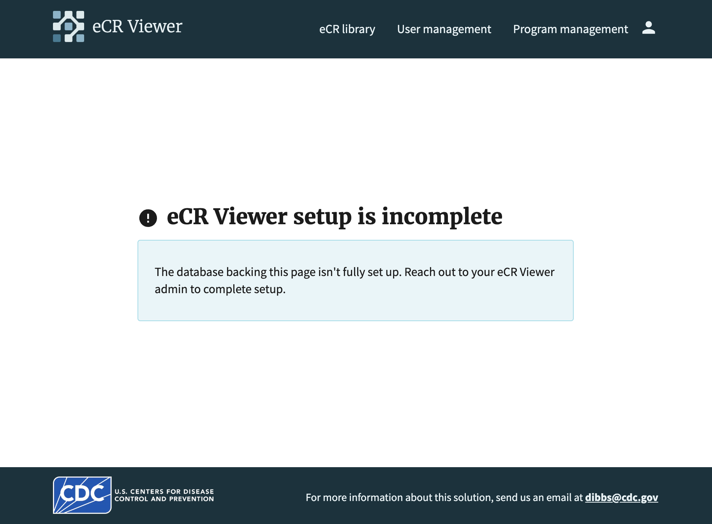

# Technical Acceptance Testing

This document guides installers of the DIBBs eCR Viewer through testing needed to verify installation.

## Overview

After you’ve installed DIBBs services in your jurisdiction, this guide walks you through the steps needed to verify the installation. This will ensure that the system has been properly installed in your environment and that it’s ready for your public health department to interact with.

Please consult the [eCR Viewer Setup Guide](https://cdcgov.github.io/dibbs-ecr-viewer/documents/Setup_Guide.html) to verify that your environment variables and infrastructure have been configured correctly.

## Prerequisites

- You’ve installed DIBBs services using [DIBBs AWS Terraform,](https://github.com/CDCgov/dibbs-aws) [DIBBs Azure Terraform](https://github.com/CDCgov/dibbs-azure), [DIBBs VM](https://github.com/CDCgov/dibbs-vm), or a custom installation.
- You’ve set the appropriate environment variables for your configuration based on the [setup guide](https://cdcgov.github.io/dibbs-ecr-viewer/documents/Setup_Guide.html#environment-variable-setup).
- You have access to sample eCR/RR files.
- You have [PuttyGen for Windows](https://www.chiark.greenend.org.uk/~sgtatham/putty/latest.html) or ssh-keygen for MacOS/Linux, and access to Node.js with JWT libraries for authentication testing.

## Acceptance Checklist

The following instructions will guide you through this list.

- Verified that the eCR Viewer health check is available
- Verified that the metadata database is up to date (if using one)
- Verified that the `process-ecr` endpoint run was successful
- Verified that the eCR FHIR bundle is available in blob storage
- Verified that the processed eCR is visible in the viewer

## Authentication Setup for API Testing

Most `/ecr-viewer/api/` routes require authentication to be used. The exceptions are public routes such as the health check and authentication routes.

For integrated authentication, the token will be generated using a private key, and validated using the corresponding public key set in the `NBS_API_PUB_KEY` environment variable. For non-integrated authentication, the token must be generated by your Identity Provider (IDP) service.

### Setting Public/Private Key for Integrated Authentication

To generate the required keys for integrated authentication:

1. Generate a private key:

**For Windows using PuttyGen:**

- Download and open [PuttyGen](https://www.chiark.greenend.org.uk/~sgtatham/putty/latest.html)
- Select "RSA" and set key size to 4096 bits
- Click "Generate" and move mouse to create randomness
- Save the private key as "private_key.ppk"
- Copy the public key from the text box and save as "public_key.pub"

**For MacOS/Linux using ssh-keygen:**

```shell
ssh-keygen -t rsa -b 4096 -f private_key.pem -N ""
```

2. Extract the public key (MacOS/Linux only):

```shell
ssh-keygen -y -f private_key.pem > public_key.pub
```

3. Set the public key as the `NBS_API_PUB_KEY` environment variable:

```shell
export NBS_API_PUB_KEY="$(cat public_key.pub)"
```

### Generating a JWT for Testing

Use your private key to generate a JWT token for API requests. The token should be sent on the `Authorization` header of requests.

**Example using Node.js:**

```javascript
const jwt = require("jsonwebtoken");
const fs = require("fs");

const privateKey = fs.readFileSync("private_key.pem");
const payload = {
  exp: Math.floor(Date.now() / 1000) + 60 * 60, // 1 hour expiration
  iat: Math.floor(Date.now() / 1000),
};
const token = jwt.sign(payload, privateKey, { algorithm: "RS256" });
```

### Non-Integrated Authentication

For non-integrated authentication, tokens must be generated by your IDP service (Azure AD, Entra, or Keycloak) using a service principal. The token will be validated using the authentication provider configured in the environment variables.

## Installation Testing

To test the installation, we’ll run a series of API requests to the DIBBs services.

`{{dibbs-url}}` will be used throughout the document to indicate the URL your services are available on — use your own URL instead.

Instructions have been provided for different operating systems, so follow the instructions applicable to your machine.

### 1. eCR Viewer Health Check

Here, we’ll verify that the eCR Viewer service is available to receive requests by running the eCR Viewer Health Check request.

<details>
<summary>Powershell (compatible with versions 5 and 7)</summary>

```powershell
Invoke-WebRequest -Uri "https://{{dibbs-url}}/ecr-viewer/api/health-check" -UseBasicParsing
```

</details>

<details>
<summary>Unix (Mac, Linux) or Windows Command Prompt</summary>

```bash
curl https://{{dibbs-url}}/ecr-viewer/api/health-check
```

</details>

You should receive the following response:

```json
{ "status": "OK", "version": {{app version}}, "dependencies": { {{dependency name}}: {{status ("UP" or "DOWN")}} } }
```

### 2. Database Migrations

If you are running the NBS-integrated version of the Viewer, you can skip this step.

If you are running the viewer with a metadata database (standalone or dual boot), you will need to run database migrations upon the first install of the application or anytime there is an update to the database schema. If migrations need to be applied, you will see an error when trying to use the viewer.



In order to apply migrations, you will need the migration secret. This can be set to a static value by setting the `METADATA_DATABASE_MIGRATION_SECRET`, otherwise it will be generated randomly each time the viewer is started. Once generated, it will be logged to the eCR Viewer server logs. Check your container's logs to find this secret - it will be logged as `migration_secret=<your secret here>`.

<details>
<summary>Powershell 5 and 7</summary>

```powershell
$boundary = [guid]::NewGuid().ToString()
$body = (
    "--$boundary",
    "Content-Disposition: form-data; name=`"migration_secret`"",
    "Content-Type: application/text",
    "",
    "{{ migration-secret }}",
    "--$boundary--"
) -join "`r`n"

$headers = @{
    "Content-Type" = "multipart/form-data; boundary=$boundary"
}

Invoke-RestMethod -Uri "https://{{ dibbs-url }}/ecr-viewer/api/migrate-db" `
-Method Post -Headers $headers -Body $body
```

</details>

<details>
<summary>Unix (Mac, Linux) and Windows Command Prompt</summary>

```bash
curl {{ dibbs-url }}/ecr-viewer/api/migrate-db --form migration_secret={{ migration-secret }}
```

</details>

### 3. Pipeline Run

Now, we need to verify that an eCR can run through the DIBBs pipeline. Below, you'll need to replace `{{path-to-eCR-zip-file}}` with the actual link to your sample eCR/RR zip file and `{{jwt-token}}` with your generated JWT token.

Please ensure that the sample eCR you're using is a zip file, and the eICR and RR files are named as they are coming out of AIMs — CDA_eICR.xml and CDA_RR.xml.

Run the Process eCR request:

<details>
<summary>Powershell 5</summary>

```powershell
$FilePath = '{{ path-to-eCR-zip-file }}'
$URL = 'https://{{ dibbs-url }}/ecr-viewer/api/process-ecr'
$Token = '{{ jwt-token }}'

Function Import-ApiForm {
    param(
        [Parameter(Mandatory = $true)][String] $URI,
        [Parameter(Mandatory = $true)][System.IO.FileSystemInfo] $File,
        [Parameter(Mandatory = $true)][String] $ContentType,
        [Parameter(Mandatory = $true)][String] $NewName,
        [Parameter(Mandatory = $true)][String] $AuthToken
    )
    BEGIN{
    $FormTemplate = @'
--{0}
Content-Disposition: form-data; name="upload_file"; filename="{1}"
Content-Type: {2}

{3}
--{0}--

'@
    $enc = [System.Text.Encoding]::GetEncoding("iso-8859-1")
    }
    PROCESS{
        $Result = $False
        $boundary = [guid]::NewGuid().Guid
        $bytes = [System.IO.File]::ReadAllBytes($File.FullName)
        $Data = $enc.GetString($bytes)
        $body = $FormTemplate -f $boundary, $NewName, $ContentType, $Data
        $FormContentType = "multipart/form-data; boundary=$boundary"

        $headers = @{
            "Authorization" = "Bearer $AuthToken"
        }

        Try {
            $Result = Invoke-RestMethod -Uri $Uri -Method POST -ContentType $FormContentType -Body $body -Headers $headers -DisableKeepAlive
        } Catch {
            Write-Error $_
        }
        return $Result
    }
    END{}
}

$FileInfo = Get-Item $FilePath
Import-ApiForm -URI $URL -File $FileInfo -ContentType "application/zip" -NewName "ecr_zip" -AuthToken $Token
```

</details>

<details>
<summary>Powershell 7</summary>

```powershell
$FilePath = "{{path-to-eCR-zip-file}}"
$Token = "{{jwt-token}}"

$headers = @{
    "Authorization" = "Bearer $Token"
}

Invoke-WebRequest -Uri "https://{{ dibbs-url }}/ecr-viewer/api/process-ecr" `
    -Method Post `
    -UseBasicParsing `
    -Form @{ upload_file = Get-Item $FilePath } `
    -Headers $headers
```

</details>

<details>
<summary>Windows Command Prompt</summary>

```bash
curl {{ dibbs-url }}/ecr-viewer/api/process-ecr ^
    --form upload_file=@"{{ path to file }}";type=application/zip ^
    --header 'Authorization: Bearer {{jwt-token}}'
```

</details>

<details>
<summary>Unix (Mac, Linux)</summary>

```bash
curl {{ dibbs-url }}/ecr-viewer/api/process-ecr \
    --form 'upload_file=@"{{ path to file }}";type=application/zip' \
    --header 'Authorization: Bearer {{jwt-token}}'
```

</details>

You should see the following response:

```json
{ "message": "Success. Saved FHIR bundle." }
```

### 4. Check FHIR Bundle Storage

To confirm that the eCR processed through the DIBBs pipeline correctly, we’ll manually check the output FHIR bundles in blob storage.

Navigate to your cloud provider’s console and find the DIBBs blob storage component. You should see the eCR that was just processed in blob storage.

Take note of the eCR file name `{{ecr-id}}.json` in blob storage — you'll need it for the next step.

### 5. View Processed eCR

Verify that the eCR Viewer is able to display the eCR that was processed.

To access that eCR, run the following request in a browser:

```http
http://{{dibbs-url}}/ecr-viewer/view-data?id={{ecr-id}}
```

where `{{ecr-id}}` should be replaced with the eCR ID that you copied from the last step.

Please note that depending on your authentication settings for the Viewer, this step may not work directly from a browser – you may have to find the eCR in your NBS environment instead, and use the “View eICR Document” button to view. However, even if you hit an authentication error on this page, it means the Viewer is configured correctly.

## Debugging

If you run into any issues during testing, please reach out to the DIBBs team! We want to know if there are changes needed to the core pipeline. You can email us at [dibbs@cdc.gov](mailto:dibbs@cdc.gov).

Some common errors are noted below.

### Invalid data

If your eCR contains invalid data, it will be rejected by the pipeline. You’ll see a message like:

```json
{ "message": "Failed to save FHIR bundle." }
```

Or:

```json
{ "message": "Internal Server Error" }
```

More details can typically be found in the server's logs. Generally speaking, you can get around this error by re-running or choosing a different eCR bundle. You’ll also need to make sure your eCRs are named as they are coming out of AIMs — `CDA_eICR.xml` and `CDA_RR.xml`.

## Next Steps

Congratulations! You’ve completed the verification process for the DIBBs installation.

Please reach to your contact within your public health department and [dibbs@cdc.gov](mailto:dibbs@cdc.gov) to confirm that the installation was successful.
