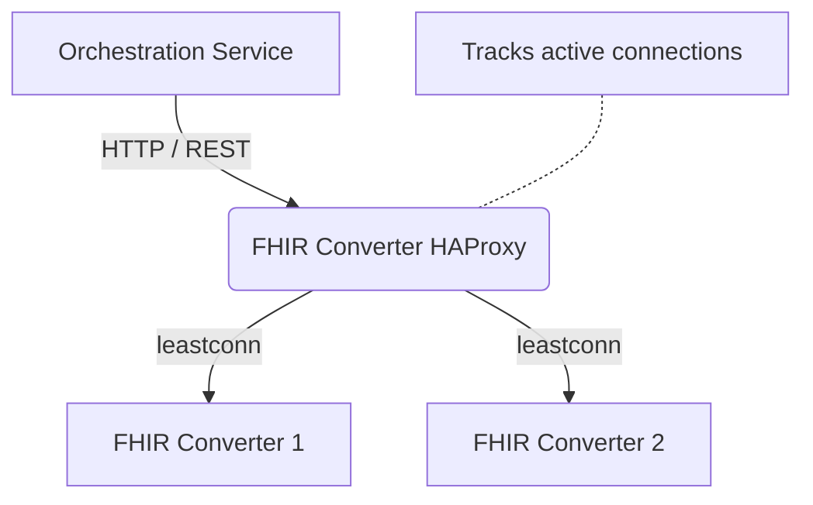

# DIBBs FHIR Converter Proxy

## Summary

This container runs an HAProxy Layer 7 gateway that **optionally** sits between the Orchestration Service and the FHIR Converter instances.

The configuration provided here is meant to replace the default Round Robin routing used in AWS ServiceConnect with a "Least Connections" (`leastconn`) algorithm to intelligently distribute Electronic Case Reporting (eCR) payloads. This helps reduce CPU/Memory hotspots and container crashes. It can be used with other cloud providers if desired but would require a custom configuration and image.

## Overview

The FHIR Converter HAProxy Gateway is a dedicated proxy designed for the DIBBs eCR Viewer architecture and is meant to replace the default load balancing used in AWS.

By default, AWS ServiceConnect and standard Docker Compose networks use a **Round Robin** load balancing strategy. While effective for uniform requests, Round Robin fails under the highly variable load of Electronic Case Reporting (eCR). When processing large eCR bundles, Round Robin frequently assigns multiple large payloads to the same FHIR converter instance, causing bottlenecks and "Out of Memory" crashes while other instances sit completely idle.

This container solves that by using **HAProxy** to track exactly how busy each converter is, routing new eCRs only to the instances with the most available capacity.

## Setup

Update the haproxy.cfg if necessary for your deployed infrastructure or use the provided sample if using AWS ECS.

If you plan to use a different config file from the provided one, you will need to create a new HAProxy image and deploy it to your environment. Otherwise, use the provided FHIR Converter Proxy image in the same way as you use the other service images in this project.

The Orchestration service uses the `FHIR_CONVERTER_URL` env var to determine where to send requests. Set this to the FHIR Converter Proxy URL to route traffic through the proxy instead of pointing directly to the FHIR Converter service.

## Architecture

