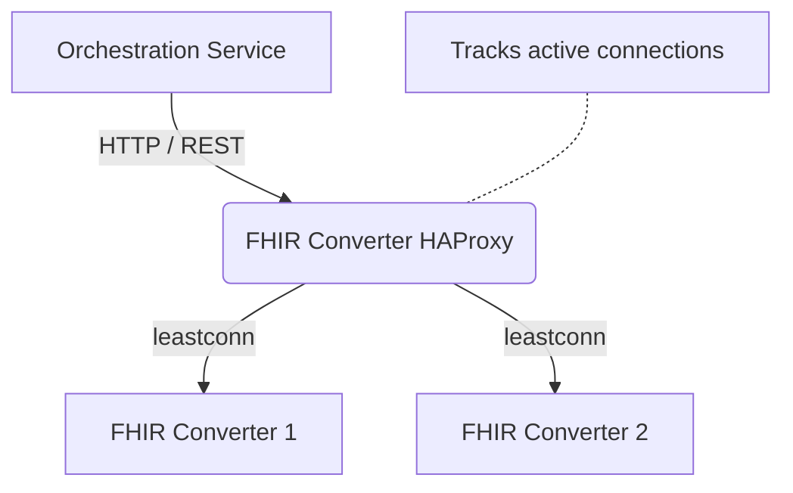

# DIBBs FHIR Converter Proxy

## Summary

This container runs an HAProxy Layer 7 gateway that **optionally** sits between the Orchestration Service and the FHIR Converter instances. It replaces default Round Robin routing with a "Least Connections" (`leastconn`) algorithm to intelligently distribute Electronic Case Reporting (eCR) payloads. This reduces CPU/Memory hotspots and container crashes.

## Overview

The FHIR Converter HAProxy Gateway is a dedicated proxy designed for the DIBBs eCR Viewer architecture.

By default, AWS ServiceConnect and standard Docker Compose networks use a **Round Robin** load balancing strategy. While effective for uniform requests, Round Robin fails under the highly variable load of Electronic Case Reporting (eCR). When processing large eCR bundles, Round Robin frequently assigns multiple large payloads to the same FHIR converter instance, causing bottlenecks and "Out of Memory" crashes while other instances sit completely idle.

This container solves that by using **HAProxy** to track exactly how busy each converter is, routing new eCRs only to the instances with the most available capacity.

## Architecture

