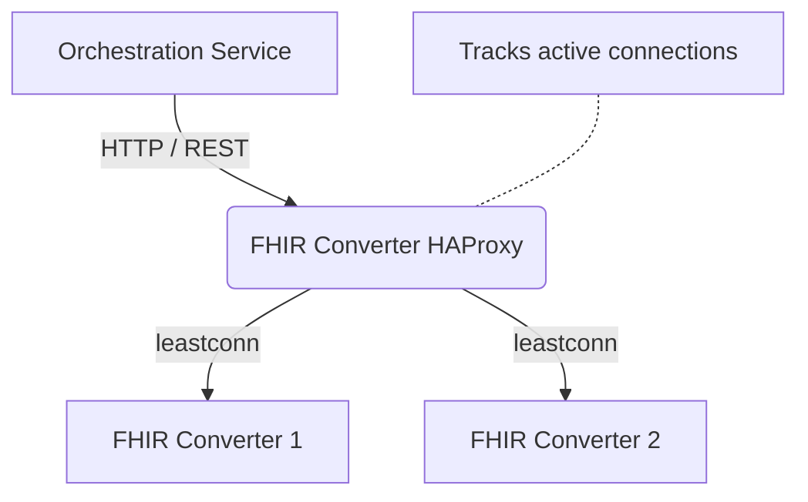

# DIBBs FHIR Converter Proxy

## Summary

This container runs an HAProxy Layer 7 gateway that **optionally** sits between the Orchestration Service and the FHIR Converter instances.

The configuration provided here is meant to replace the default Round Robin routing used in AWS ServiceConnect with a "Least Connections" (`leastconn`) algorithm to intelligently distribute Electronic Case Reporting (eCR) payloads. This helps reduce CPU/Memory hotspots and container crashes. It can be used with other cloud providers if desired but would require a custom configuration and image.

## Overview

The FHIR Converter HAProxy Gateway is a dedicated proxy designed for the DIBBs eCR Viewer architecture and is meant to replace the default load balancing used in AWS.

By default, AWS ServiceConnect and standard Docker Compose networks use a **Round Robin** load balancing strategy. While effective for uniform requests, Round Robin fails under the highly variable load of Electronic Case Reporting (eCR). When processing large eCR bundles, Round Robin frequently assigns multiple large payloads to the same FHIR converter instance, causing bottlenecks and "Out of Memory" crashes while other instances sit completely idle.

This container solves that by using **HAProxy** to track exactly how busy each converter is, routing new eCRs only to the instances with the most available capacity.

## Architecture



## Setup

If you are using AWS ECS you should be able to use the provided FHIR Converter Proxy container and image in the same way as you use the other service images in this project. Otherwise, see the section below for instructions on how to create a custom image.

The Orchestration service uses the `FHIR_CONVERTER_URL` env var to determine where to send requests. Set this to the FHIR Converter Proxy URL to route traffic through the proxy instead of pointing directly to the FHIR Converter service.

### Customizing and Publishing the HAProxy Image

If you need to make changes to the routing logic, add a new backend, or tune the connection limits, you will need to update the `haproxy.cfg` file and build a new Docker image.

#### 1. Authenticate with GitHub Container Registry (GHCR)

Before you can push an image to the registry, you must authenticate using a GitHub Personal Access Token (PAT) with the `write:packages` scope.

```bash
export CR_PAT="YOUR_GITHUB_PAT"
echo $CR_PAT | docker login ghcr.io -u YOUR_GITHUB_USERNAME --password-stdin
```

#### 2. Build the Docker Image

Make your changes to `haproxy.cfg`. Then, from the same directory as the Dockerfile, run the build command. Tag the image with the GHCR URL so it is ready to push.

```bash
docker build -t ghcr.io/<github_username>/<repo_name>/fhir-converter-proxy:latest .
```

Note: Be sure to replace <github_username> and <repo_name> with the actual organization or user and the repository name (e.g., CDCgov/dibbs-ecr-viewer).

#### 3. Push the image to GHCR

Once the image is successfully built and tagged locally, push it up to the remote registry so your cluster can pull the new version. Make sure your cluster is also configured to find this image.

```bash
docker push ghcr.io/<github_username>/<repo_name>/fhir-converter-proxy:latest
```

#### Testing Locally

If you just want to build and test the proxy locally without pushing it to GitHub, you can use a simpler tag:

```bash
docker build -t fhir-proxy-local .
docker run -p 8080:8080 fhir-proxy-local
```
