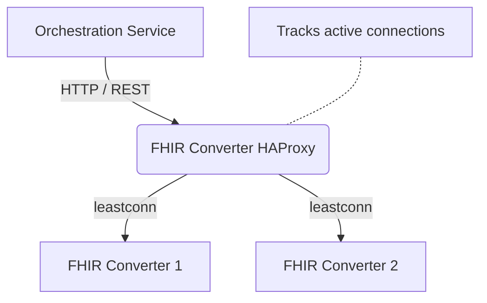

# DIBBs FHIR Converter Proxy

## Summary

This container runs an HAProxy Layer 7 gateway that **optionally** sits between the Orchestration Service and the FHIR Converter instances.

The configuration provided here is meant to replace the default Round Robin routing used in AWS ServiceConnect with a "Least Connections" (`leastconn`) algorithm to intelligently distribute Electronic Case Reporting (eCR) payloads. This helps reduce CPU/Memory hotspots and container crashes. It can be used with other cloud providers if desired but would require a custom configuration and image.

## Overview

The FHIR Converter HAProxy Gateway is a dedicated proxy designed for the DIBBs eCR Viewer architecture and is meant to replace the default load balancing used in AWS.

By default, AWS ServiceConnect and standard Docker Compose networks use a **Round Robin** load balancing strategy. While effective for uniform requests, Round Robin fails under the highly variable load of Electronic Case Reporting (eCR). When processing large eCR bundles, Round Robin frequently assigns multiple large payloads to the same FHIR converter instance, causing bottlenecks and "Out of Memory" crashes while other instances sit completely idle.

This container solves that by using **HAProxy** to track exactly how busy each converter is, routing new eCRs only to the instances with the most available capacity.

## Architecture



## Setup

If you are using AWS ECS you should be able to use the provided FHIR Converter Proxy container and image in the same way as you use the other service images in this project. Otherwise, see the section below for instructions on how to create a custom image.

The Orchestration service uses the `FHIR_CONVERTER_URL` env var to determine where to send requests. Set this to the FHIR Converter Proxy URL to route traffic through the proxy instead of pointing directly to the FHIR Converter service.

Expected environment variables:

- **FHIR_CONVERTER_PROXY_PORT** - The port used by the proxy to bind to listen to requests. Usually set to: `8080`.
- **ENVIRONMENT** - Used to determine if the proxy is running in a local environment or not. Set to `local` for local environments, otherwise it can be left unset.
- **FHIR_CONVERTER_ECS_NAMESPACE** - Used to assemble the host URL for AWS ECS instances using the DNS resolver, can be left unset for local environments. This should be the AWS CloudMap namespace name used by ECS. This environment variable is set in the TF module along with the definition of the `fhir-converter-dns` resource used for the resolver host.
- **FHIR_CONVERTER_PORT** - The FHIR Converter service port to route requests to. Usually set to: `8080`. Only the port is needed because the host is derived from the environment (for local) or the `FHIR_CONVERTER_ECS_NAMESPACE` for AWS.

### Customizing and Publishing the HAProxy Image

If you need to make changes to the routing logic, add a new backend, or tune the connection limits, you will need to update the `haproxy.cfg` file and build a new Docker image.

#### 1. Make necessary updates to the HAProxy configuration file

Make your changes to `haproxy.cfg`, official documentation can be found [here](https://www.haproxy.com/documentation/haproxy-configuration-manual/latest/).

Make sure any new environment variables are passed into the container.

#### 2. Build the Docker Image

From the same directory as the Dockerfile, run the build command. Tag the image with the GHCR URL (if using GHCR) so it is ready to push.

```bash
docker build -t ghcr.io/<github_username>/<repo_name>/fhir-converter-proxy:<image_version> .
```

Note: Be sure to replace <github_username> and <repo_name> with the actual organization or user and the repository name (e.g., CDCgov/dibbs-ecr-viewer) and <image_version> with a placeholder or final version of the proxy image.

For local testing you can use a simpler tag too:

```bash
docker build -t fhir-proxy-local .
docker run -p 8080:8080 fhir-proxy-local
```

#### 3. Push the image to your image repository

Once the image is successfully built and tagged locally, push it up to the remote registry so your cluster can pull the new version. Make sure your cluster is also configured to find this image.

#### 4. Confirm the proxy started properly and is routing requests

Check the proxy logs for any errors, it should be able to start-up with no errors. Once traffic starts being routed it will log requests it routes.

An example of a successful start of the proxy and routing logs looks like this:

```
[NOTICE]   (1) : Initializing new worker (8)
[NOTICE]   (8) : Automatically setting global.maxconn to 524256.
[NOTICE]   (1) : Loading success.
172.18.0.10:37636 [05/May/2026:17:12:35.713] fhir_converter_proxy local_converters/converter-1 2/0/28/4630/4665 200 98024 - - ---- 8/8/6/3/0 0/0 "POST /convert-to-fhir HTTP/1.1"
172.18.0.10:37648 [05/May/2026:17:12:35.713] fhir_converter_proxy local_converters/converter-1 3/0/26/4631/4665 200 82659 - - ---- 8/8/5/2/0 0/0 "POST /convert-to-fhir HTTP/1.1"
```
