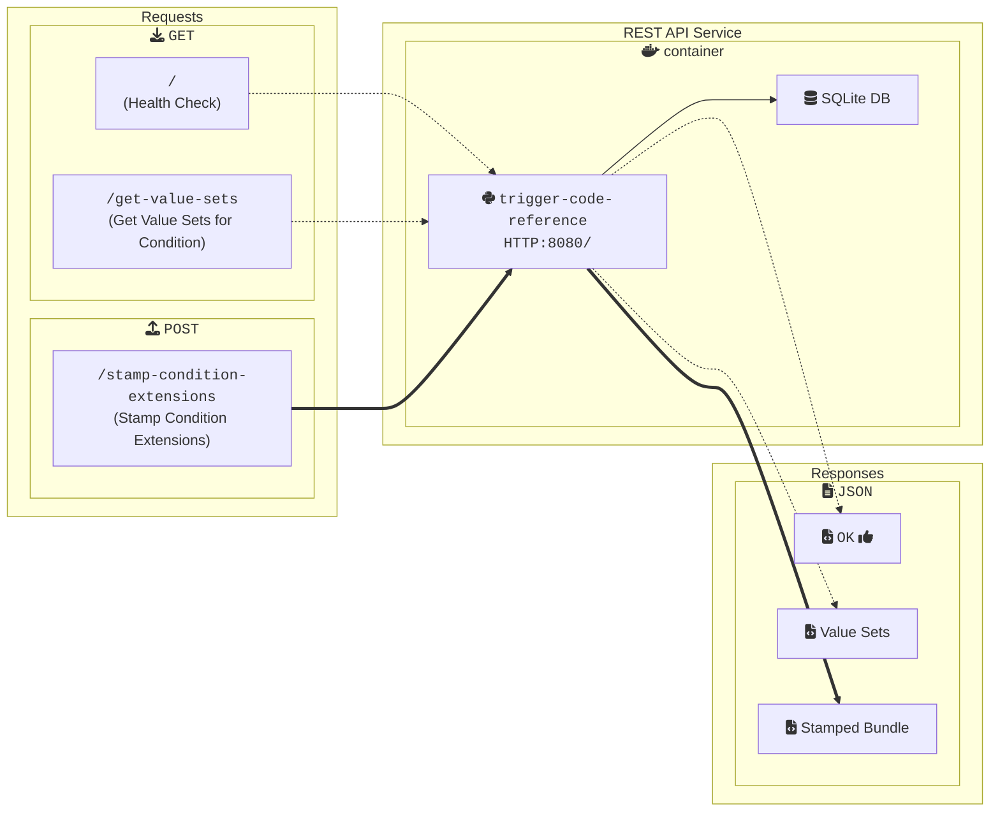

## Getting Started with the DIBBs Trigger Code Reference Service

### Introduction

The DIBBs Trigger Code Reference (TCR) service offers a REST API devoted to querying and enriching SNOMED condition code analysis. This service stores condition codes and their associated value sets, which users can query and insert into supplied FHIR bundles as tagged extensions for future path parsing.

### Running the Trigger Code Reference Service

You can run the TCR using Docker. another OCI container runtime (e.g., Podman), or directly from the Python source code.

#### Running with Docker (Recommended)

To run the trigger code reference with Docker, follow these steps.

1. Confirm that you have Docker installed by running docker -v. If you don't see a response similar to what's shown below, follow [these instructions](https://docs.docker.com/get-docker/) to install Docker.

```
❯ docker -v
Docker version 20.10.21, build baeda1f
```

2. Download a copy of the Docker image from the dibbs-ecr-viewer repository by running `docker pull ghcr.io/cdcgov/dibbs-ecr-viewer/trigger-code-reference:latest`.
3. Run the service with ` docker run -p 8080:8080 trigger-code-reference:latest`.

Congratulations, the TCR should now be running on `localhost:8080`!

#### Running from Python Source Code

We recommend running the TCR from a container, but if that isn't feasible for a given use case, you can also run the service directly from Python using the steps below.

1. Ensure that both Git and Python 3.13 or higher are installed.
2. Clone the dibbs-ecr-viewer repository with `git clone https://github.com/CDCgov/dibbs-ecr-viewer`.
3. Navigate to `/dibbs-ecr-viewer/containers/trigger-code-reference/`.
4. Make a fresh virtual environment with `python -m venv .venv`.
5. Activate the virtual environment with `source .venv/bin/activate` (MacOS and Linux), `venv\Scripts\activate` (Windows Command Prompt), or `.venv\Scripts\Activate.ps1` (Windows Power Shell).
6. Install all of the Python dependencies for the tr with `pip install -r requirements.txt` into your virtual environment.
7. Run the trigger code reference on `localhost:8080` with `python -m uvicorn app.main:app --host 0.0.0.0 --port 8080`.

### Building the Docker Image

To build the Docker image for the trigger code reference from source instead of downloading it from the dibbs-ecr-viewer repository follow these steps.

1. Ensure that both [Git](https://git-scm.com/book/en/v2/Getting-Started-Installing-Git) and [Docker](https://docs.docker.com/get-docker/) are installed.
2. Clone the dibbs-ecr-viewer repository with `git clone https://github.com/CDCgov/dibbs-ecr-viewer`.
3. Navigate to `/dibbs-ecr-viewer/containers/trigger-code-reference/`.
4. Run `docker buildx build --platform linux/amd64 -t trigger-code-reference .`.

### Adding Packages

To prevent the execution of malicious `setup.py` scripts during installation, our Docker builds enforce strict hash-checking and exclusively use pre-compiled binaries (Wheels). To add a new package please follow these instructions:

1. Add your new package to the `requirements.in` file.
2. Make sure you have `pip-tools` installed.
3. Compile the strict lockfile by running:
   ```bash
   pip-compile --generate-hashes requirements.in
   ```
4. Try to build the Docker container.
   - If it succeeds, the package has a pre-compiled wheel available. You are done!
   - If it fails with `exit code: 1` and an error stating `ERROR: Could not find a version that satisfies the requirement` (specifically complaining about no matching distribution), it means PyPI only has a Source Distribution available for that package.
5. To allow pip to build the package from source safely, you must add it to the `--no-binary` flag in the Dockerfile.
   - Locate the pip install command in the Dockerfile.
   - Add the base name of the package to the comma-separated `--no-binary list` (no spaces, no version numbers). **Example:** Change `--no-binary google-crc32c` to `--no-binary google-crc32c,your-new-package`
6. You should be able to use your new package now!

### The API

When viewing these docs from the `/redoc` endpoint on a running instance of the TCR or the DIBBs website, detailed documentation on the API will be available below.

### Architecture Diagram


