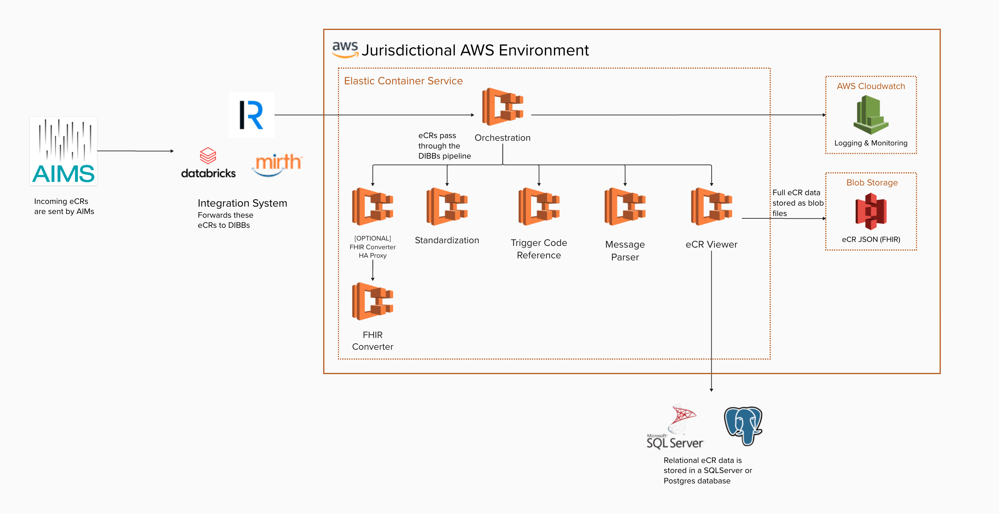

# eCR Viewer Cloud Deployment Guide - AWS

This guide explains how to deploy eCR Viewer on AWS using either:

- Managed deployment: Terraform-managed infrastructure on AWS ECS
- Linux Scripts: Ubuntu compatible scripts that configure a virtual machine to run the eCR Viewer containers

Both approaches ultimately rely on the same eCR Viewer configuration model and environment variables. For details on environment variables and configuration options, refer to the [eCR Viewer Setup Guide](./Setup%20Guide.md#general-background) and [environment variable reference](./Environment%20Variables.md).

## Choose deployment approach

### Option A: Managed AWS deployment

Choose this if your jurisdiction wants:

- A repeatable deployment managed with Infrastructure as Code (Terraform)
- A managed container runtime (ECS)
- A deployment approach designed to be updated over time using releases

Primary repo: [dibbs-aws](https://github.com/CDCgov/dibbs-aws/tree/main)  
README: https://github.com/CDCgov/dibbs-aws/blob/main/README.md  
Implementation: https://github.com/CDCgov/dibbs-aws/blob/main/IMPLEMENTATION.md  

#### Skill requirements

Doing this work will require somebody who can:

- Read/write/run Terraform configurations
- Understand Terraform state management
- Work with AWS resources (IAM, networking, ECS and supporting services)

### Option B: Linux Scripts

Choose this if your jurisdiction wants:

- A deployment that doesn’t require managing custom-built VM images
- A cloud-agnostic or on-prem deployment
- A straightforward operational model (one Linux VM running Docker containers)
- A more traditional “server-based” approach
- A path that is easier to understand for teams that don’t run containers on ECS today

Primary repo: [dibbs-ecr-viewer](https://github.com/CDCgov/dibbs-ecr-viewer/tree/main)  
README: https://github.com/CDCgov/dibbs-ecr-viewer/blob/main/deployment/vm/README.md  

#### Skill requirements

Doing this work will require staff who can:

- Run scripts and configure inventory files.
- Install and operate Docker + Docker Compose
- Manage AWS networking/security groups and access to supporting services (storage, database, identity)

## Managed deployment on AWS

### Prerequisites

#### Application prerequisites

Be­fore you get start­ed, please make sure you have determined the eCR Viewer configuration your organization plans to use.

View the [Setup Guide](./Setup%20Guide.md#general-background) and [Environment variable reference](./Environment%20Variables.md) for information about the available configurations.

#### Infrastructure prerequisites

The computer (or CI/CD system) you run the deployment from should have:

- Terraform version 1.0.0+ [Hashicorp installation Guide](https://developer.hashicorp.com/terraform/tutorials/aws-get-started/install-cli)
  - [Terraform Documentation](https://github.com/CDCgov/dibbs-aws/blob/main/README.md#411-terraform-documentation)
- AWS CLI version 2+ [AWS CLI Installation Guide](https://docs.aws.amazon.com/cli/v1/userguide/cli-chap-install.html)
- AWS Profile Access

#### AWS account prerequisites

Before you deploy, you should have:

- An AWS account space you’re allowed to deploy into
- A plan for Terraform state management (where state lives, who can access it, how environments are separated) consistent with your organization’s Terraform practices
- AWS permissions and governance approvals required by your organization (IAM roles, allowed regions/services, networking constraints, etc.)

### Architectural Design

The current architectural design for [dibbs-aws](https://github.com/CDCgov/dibbs-aws/tree/main) is as follows:

### Deployment workflow

Use the [dibbs-aws](https://github.com/CDCgov/dibbs-aws/tree/main) repository and [Implementation docs](https://github.com/CDCgov/dibbs-aws/blob/main/IMPLEMENTATION.md) as the step-by-step source of truth.

The high-level workflow below is provided as a guide to help you understand the overall deployment sequence:

1. Start from dibbs-aws (fork or copy into your organization).
2. Configure the Terraform backend/state approach and environment settings
3. Deploy the infrastructure and ECS services using the repo’s documented workflow
4. Run Technical Acceptance Testing

## VM deployment on AWS

### Prerequisites

#### Application prerequisites

Be­fore you get start­ed, please make sure you have determined the eCR Viewer configuration your organization plans to use.

View the [Setup Guide](./Setup%20Guide.md#general-background) and [Environment variable reference](./Environment%20Variables.md) for information about the available configurations.

#### Infrastructure prerequisites

- Ability to create an S3 bucket to store eCR data
- Ability to create an EC2 instance
- Ability to create IAM roles, policies to allow resource access
- A database accessible over the AWS network if you are using `NON_INTEGRATED` or `DUAL` configurations
- An Entra or Keycloak client registration or NBS authentication, depending on your configuration

#### AWS account prerequisites

Before you deploy, you should have:

- An AWS account with the permissions and functionality required to deploy and operate an AWS EC2 instance
- Access to an Ubuntu image on the AWS marketplace

### Deployment workflow

Use the [dibbs-ecr-viewer](https://github.com/CDCgov/dibbs-ecr-viewer/tree/main) repository as the source of truth.

The high-level workflow below is provided as a guide to help you understand the overall deployment sequence:

1. Decide your eCR Viewer configuration
2. Configure your AWS account to support the eCR Viewer (e.g., S3 bucket, database)
3. Launch an Ubuntu-based EC2 instance
4. Secure the EC2 instance according to your policy rules
5. Configure the eCR Viewer environment variables using the ecrv-update script
6. Run Technical Acceptance Testing
