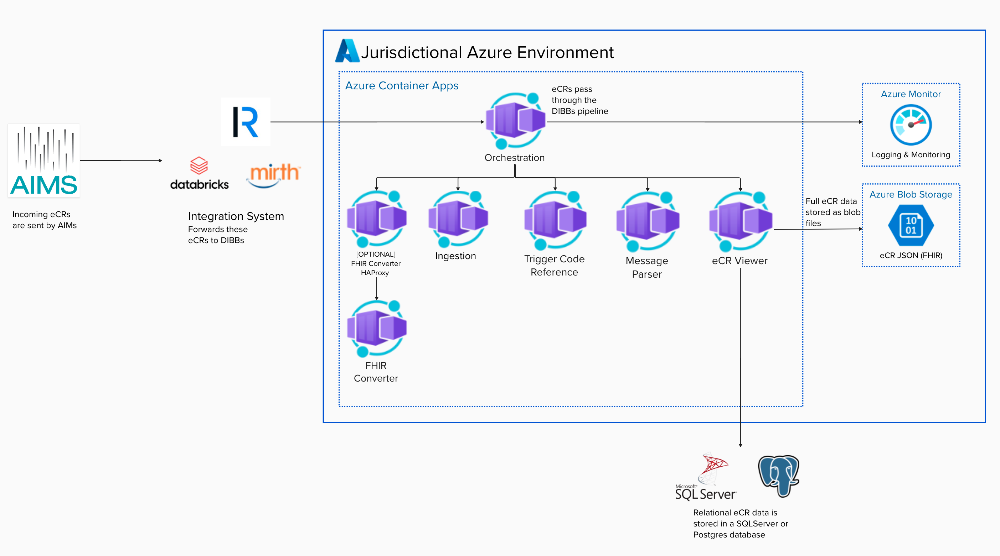

# eCR Viewer Cloud Deployment Guide - Azure

This guide describes how to deploy eCR Viewer on Azure using a managed, Terraform-based approach (i.e., Azure Container Apps).

Primary repo: [dibbs-azure](https://github.com/CDCgov/dibbs-azure/tree/main)  
README: https://github.com/CDCgov/dibbs-azure/blob/main/README.md

## Prerequisites

### Skill requirements

Doing this work will require staff who can:

- Read/write/run Terraform configurations
- Understand Terraform state management
- Work with Azure cloud provider resources (subscription, resource groups, identity/permissions, and supporting services)

### Application prerequisites

Be­fore you get start­ed, please make sure you have determined the eCR Viewer configuration your organization plans to use.

[View the Setup Guide](./setup.md#general-background) for information about the available configurations.

### Infrastructure prerequisites

The computer (or CI/CD system) you run the deployment from should have:

- Terraform v1.7.4 or later
- Microsoft Azure CLI 2.61.0 or later
- Git

### Azure account prerequisites

Before you deploy, you should have:

- An existing Resource Group and Storage Account to store Terraform state files
- A Service Principal with Contributor access to the Resource Group (or an engineer with equivalent access)
- Required Azure resource providers enabled for the services being deployed (e.g., Azure App Gateway and Azure Container Apps)

## Architectural Design

The current architectural design for [dibbs-azure](https://github.com/CDCgov/dibbs-azure/tree/main) is as follows:

## Deployment workflow

Use the [dibbs-azure](https://github.com/CDCgov/dibbs-azure/tree/main) repository and [README](https://github.com/CDCgov/dibbs-azure/blob/main/README.md) as the step-by-step source of truth.

The high-level workflow below is provided as a guide to help you understand the overall deployment sequence:

1. Start from dibbs-azure (fork or copy into your organization).
2. Configure the Terraform backend/state approach and environment settings
3. Deploy the infrastructure and Azure Container Apps (ACA) using the repo’s documented workflow.
4. Run Technical Acceptance Testing.

## Configuration and environment variables

For managed deployments, environment variables are set through the Terraform/ACA configuration. Use the [Setup Guide](./setup.md) and [Environment variable reference](./environment-variables.md) to determine:

- Which configuration you are using
- The required environment variables
- What each variable controls
